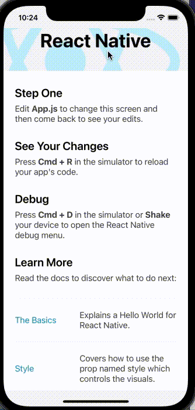

# react-native-detect-press-outside

A wrapper view that helps to detect when user press outside a child component by passing a ref to this component as a prop.

Install with [Yarn](https://yarnpkg.com/):

```sh
yarn add react-native-detect-press-outside
```

Or with [NPM](https://www.npmjs.com/):

```sh
npm i react-native-detect-press-outside
```

Import into your component like so:

```javascript
import OutsideView from 'react-native-detect-press-outside';
```

<!-- USAGE EXAMPLES -->
## Usage

```javascript
import OutsideView from 'react-native-detect-press-outside';

const App = () => {
  const childRef = useRef();

  return (
    <OutsideView 
      childRef={childRef}
      onPressOutside={() => {
        // handle press outside of childRef event
      }}
    >
      <View />
      <View>
        <View ref={childRef}/> // The component you want to detect press event outside of it
      </View>
      <View />
    </OutsideView>
  );
};
```

**Props:**

- **The OutsideView component was built base on [View](https://reactnative.dev/docs/view) component so it will accept all [View's Props](https://reactnative.dev/docs/view#props)**
- **`childRef`**: ref of the component that you want to detect press event outside of.
- **`onPressOutside`**: callback function when press outside of childref


Here's an [example](https://github.com/cuongtranduc/react-native-detect-press-outside/tree/main/example) of how to use this library

<p align="left">
  
</p>
